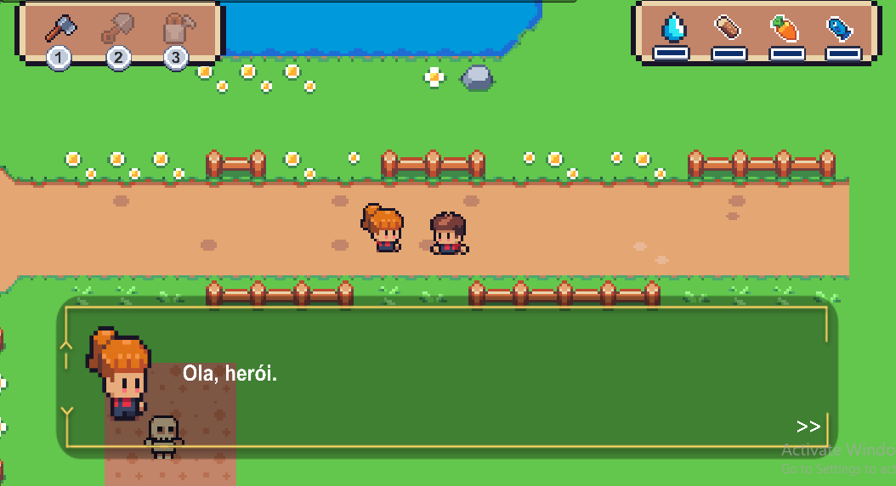
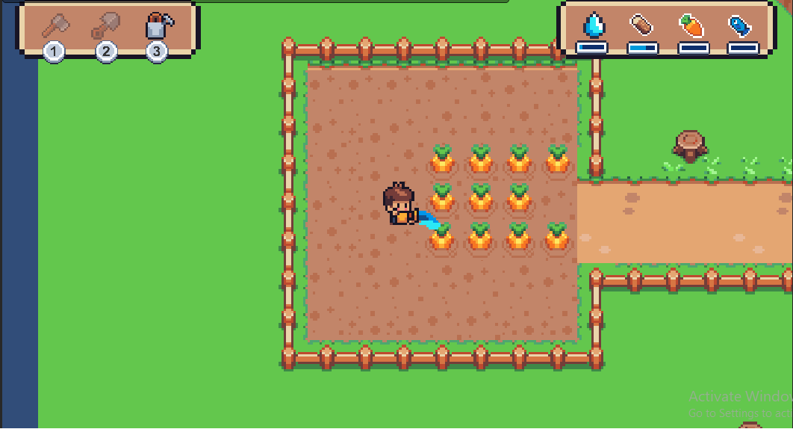

# Start GameDev
Trata-se de um codigo realizado durante o aprendizado do curso "Start GameDev". 

## Objetivo:  
Desenvolver um jogo com o software [Unity](https://unity.com/pt), seguindo as etapas a seguir:
- Introdução a Unity
- Introdução a programação(Lógica básica C#)
- Criação de cenário
- Criação de personagem(controlado pelo jogador)
- Criação de NPC(personagem não jogável)
- Crafting(cortar e coletar insumos)
- Plantação
- HUD(Tornar visivel ferramentas e materiais coletados pelo jogador)
- Pescaria
- Construção
- Combate
- Sons do jogo

## Imagens do jogo:
<h1 align="center" style="font-size: 20px;">Diálogo com NPC</h1>

<h1 align="center" style="font-size: 20px;">Plantações</h1>

## Software:
### Unity
Foi necessário baixar o [unityHub](https://unity.com/pt/download) na versão 2020.1.3

Adicionar modulos dentro da instalação:
- Windows Build Support(IL2CPP)
- get a free personal license